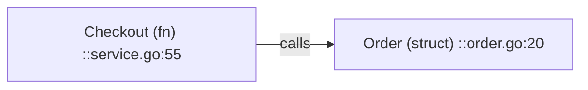

# Explain Project

分析项目 → **讲解 + 依赖图**（可到结构体/函数）。图节点/边必须对应**真实符号** + `file:line`；核实不了标 unverified 或不入图。

**证据优先级**：**代码第一，文档为辅**（见 AGENTS.md #7）。图与讲解只描述代码里真实存在的关系；文档与代码冲突时以代码为准并标出冲突。

**何时**：讲项目、画依赖图、接手陌生仓库。

## 产出

`docs/project-map/`：`OVERVIEW.md`（讲解）· `DEPENDENCY.md`（Mermaid）· `INDEX.md`（符号→路径）。模板：[PROJECT-MAP-TEMPLATE.md](PROJECT-MAP-TEMPLATE.md)。

**层级**：L0 子系统 → L1 模块（默认）→ L2 类型/结构体 → L3 函数（**仅核心路径**）。图例：imports/calls/owns/implements/unverified。

## Phase 0 — Scope

确认：受众 · 深度层 · 入口符号（若有）· 产出目录。栈从 lockfile/构建配置读，不问环境已有的。

**完成**：范围+深度+入口+目录。

## Phase 1 — Explore

README/构建/workspace/AGENTS · 源码与测试布局 · main/CLI/HTTP 入口 · 已有架构文档（**仅辅助**；与代码不一致时以代码为准并记入 brief）。

**完成**：Stack & layout brief（语言、构建、顶层模块、疑点）。

## Phase 2 — Trace

边查边记：

- 符号表：名 | kind | path:line | 角色
- 边表：from | to | kind | 证据
- 抽样打开关键 `file:line`；入口到关键叶子至少一条完整链

**完成**：核心符号/边有证据。

## Phase 3 — Explain

`OVERVIEW.md`：是什么 · 怎么分层（对齐 L0/L1）· 主流程（入口符号链）· 关键符号表 · 如何自己读 · 未核实项。与图**同源**。

**完成**：只读 OVERVIEW+DEPENDENCY 能说出入口与核心模块。

## Phase 4 — Diagram

节点 `名称 (kind) ::path:line`（过长则 INDEX 全量）；边注 kind；一图一层级一范围；爆炸时总览+子图。

**完成**：节点可 INDEX 定位；抽查≥5 条边与代码一致；无想象模块。

## Phase 5 — Confirm

路径三件套；≤10 行口述（一句话/分层/主链）；标明 unverified。只补缺口重跑 Trace–Diagram。

## 边界

只分析作图，不改业务代码。大仓库分子系统跑。交付时提醒用户对照入口与 INDEX 抽查。
